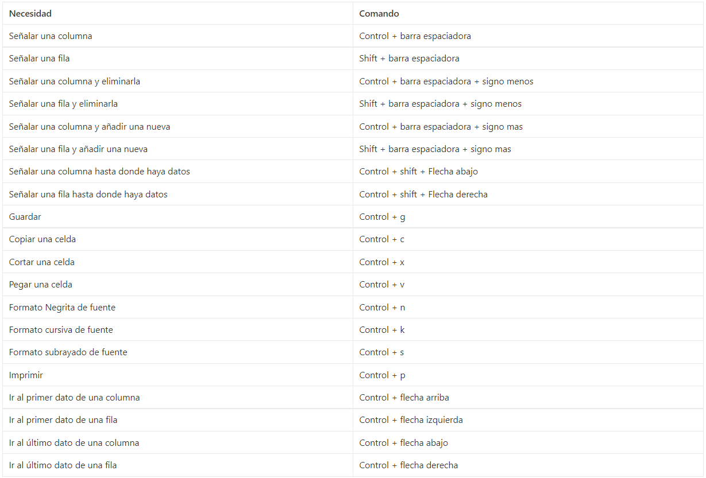
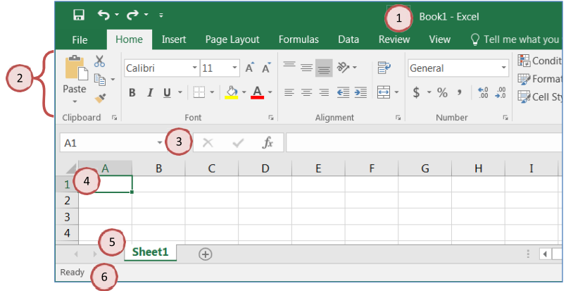

# EXCEL BASICO

Comandos para agilizar tu trabajo en Excel:

Lista desplegable:

datos ->validación de datos->lista-> en el origen seleccionamos las opciones->aceptar

SUBESTADO: subestado que depende del estado: se hace el mismo proceso pero arriba a la izquierda se cambia al nombre del estado. En el origen ponemos las siguiente fórmula: =INDIRECTO(señalamos el estado al que depende en nuestro Excel)

Vocabulary: Microsoft Excel is a spreadsheet program. We use it to create reports that need

calculations and charts.

1. An Excel file is called a Workbook.

- Default title is Book1

2. Ribbon broken into Tabs (Home, Insert, Page Layout…)

- Tabs broken into groups (Clipboard, Font, Alignment)

3. Name box (left) and formula bar (right)

- Name box shows address of current cell
- Formula bar shows contents of current cell

4. Columns Headings are Lettered, Rows Headings are Numbered

- Columns of a building, rows of chairs

5. Worksheet navigation buttons, Worksheet tabs

- Sheet1

6. Status bar

- Excel behaves differently depending on the current "mode

- $ - F4: fijar la celda.
- Ctrl + Space: seleccionar las celdas completas.
- Alt + F5: Actualizar.
- Columnas: de la A a la Z
- Filas: 1-∞
- Celda: unión de un fila y una columna.
- Iconos: representa una función que se puede usar.
- Sintaxis: estructura o partes que conforman una fórmula. Para empezar la fórmula podemos usar: =,+,-,*,/.
- Fx: muestra los argumentos de la función.
- Valores lógicos: TRUE - FALSE

Estructura de una función:

- Nombre de la función.
- Referencia: una celda con un valor dentro. Llamamos un valor que está en el lugar o celda.
- Constante: número constante.
- Operadores: +. -, *, /,...

Funciones:

- Contar.si: cuenta las celdas en el rango que coinciden en la condición dada.
    - Rango: donde está contemplada la información que se nos da (donde buscamos).
    - Criterio: “ “. Lo que buscamos. Celda con la información que buscamos.
- ContarA: cuenta el número de celdas con datos en un rango.
- Contar.blanco: cuenta el número de celdas en blanco en un rango específico.
- Moda: devuelve el valor más frecuente o repetido en los datos.
    - Moda.uno
    - Moda.varios.
- Promedio simple: sumatoria de datos dividida por la cantidad de datos.
    - Prom.si
    - Si-error.
- Vlookup - BuscarV: busca elementos en una tabla o un rango por su fila.
    - indicador de búsqueda: registro para cada dato.
    - Valor buscado: valor base
    - Matriz de tabla: donde buscamos la info
    - indicador_columnas: es el número de la columna donde vamos a traer la información
        - 0: para que sea exacta la búsqueda.
        - 1: si acepta un tipo de variación (no se usa).

Diagrama de flujo de decisión: forma gráfica de representar un algoritmo.

- Óvalo: inicio y fin.
- Rombo: demarca decisión
- flecha: marca el flujo de la información.
- Rectángulo: acción.
- Círculo: nodo. Para cerrar ciclos de decisión.

Tabla de verdad O e Y

- OR: cualquiera de las opciones.
- AND: Todas las opciones.

Función SI: comprueba si se cumple una condición.

- Prueba lógica: la condición - pregunta a resolver.
- Función SI anidada: responde 2 o varias preguntas.

GRÁFICOS: representación de datos mediante recursos visuales.

- Debe apoyar
- Debe representar los números.

Tipos de gráficos:

- De columnas o barras: para comparar la magnitud de variables.
- De líneas: se usan para representar grandes cantidades de datos que tienen lugar durante un periodo continuado de tiempo. Es decir, para representar tendencias.
- Tipo Pie: muestra como está conformada una población.
- Treemap: similar al pie pero lo muestra de forma ordenada (en cuadros o rectángulos).

Tipo de combo: Tienes el gráfico: click derecho → cambiar tipo de gráfico → combo.

- Se pueden combinar 2 gráficos.
- Se pueden poner 2 tipos de valores.

Formato condicional (conditional formatting): para identificar patrones o tendencias.

Validación de datos: Data → data validation.

- Entero
- Decimal
- Lista
- Comentario
- Mensaje de entra
- Mensaje de error.

Autofiltro: pasos:

1. Seleccionar elementos de la tabla que vamos a hacerle el filtro.
2. Datos→ordenar y filtrar→filtro.
    - Pone todas las opciones que hay en la columna. Muestra solo las que están seleccionadas.

Tablas dinámicas: Seleccionar tabla→insertar→tabla dinámica.

- Agrupar: desde dónde hasta dónde
- Definir nombre: crea un rango de datos

Gráfico dinámico: hay que tener una tabla dinámica primero.

Segmentación de datos: muestra un filtro donde podemos seleccionar qué datos vemos.

seleccionar tabla→insertar→insertar tabla→diseño de la tabla→insertar segmentación de datos→seleccionar→aceptar.

Totales y subtotales: si usamos el ∑sum, cuando hagamos filtros a la tabla este valor no se va a modificar.

- Total: =sumaproducto: devuelve la suma de los productos de los rangos o matrices correspondientes.
- Subtotal: =Subtotales: devuelve un subtotal en un lista o base de datos:
    - Pide un número de función
    - Pide la columna de la tabla a la cual vamos a hacer referencia.
    - Con el subtotal, cuando nosotros agregamos un filtro este valor va a cambiar, en el total NO.

Bloqueo de celdas: todas las celdas vienen bloqueadas por defecto.

Seleccionar→inicio→formato→bloquear celda (proteger hoja) →diferir una contraseña y opciones que tienen.

Solo las celdas que dejé desbloqueadas son las únicas que voy a poder editar.

Contraseñas de apertura y escritura: si se pone contraseña tanto para apertura como escritura sale una opción de solo lectura.

Archivo→guardar como→examinar→herramientas→opciones generales→contraseñas.