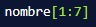
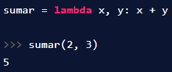
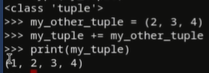

# PYTHON

- PEQUEÑA HISTORIA
    
    “Primera computadora” creada por los griegos, calcula la posición del sol, luna y algunas constelaciones.
    
    En 1801, Telar de Jacquar, separa el resultado de la información que contiene las instrucciones.
    
    Siglo XIX, Motor analítico de Babbage, haciendo uso de los avances en mecánica (engranajes) de su época logra separar instrucciones de cálculo y realizar varios cálculos a la vez.
    
    A finales del siglo XIX, ENIAC (Electronic Numerical Integrator and Computer) usaba sistema decimal. creada por Alan Turing y Alonso. Esta época exigía exactitud en los cálculos que hacían que compañías dependieran de esta(Compañías Ferroviarias por ejemplo). Turing y Alonso, descubrieron que matemáticamente todos los algoritmos podríamos reducirlos a una secuencia de soluciones matemáticas.
    
    En 1945, Arquitectura de Von Neumann, EDVAC (Electronic Discrete Variable Automatic Computer) usaba sistema binario. Su aporte fue el descubrimiento que dentro de los componentes electrónicos se puede usar una serie de hardware para realizar el cómputo y almacenar datos dentro de memoria.
    
    En 1950, Microchip, ejemplo Apple 1
    
    En el siglo XX, Arquitectura de Feymann, aporta las bases matemáticas de cómputo cuántico.
    
    Cómputo y computadoras:
    
    - Las computadoras hacen 2 cosas: hacen cálculos y recuerdan el resultado de dichos cálculos.
    - Por la mayoría de la historia humana, estábamos limitados por la velocidad del cerebro y la mano.
    - Aún con las computadoras modernas existen problemas que no podemos resolver.
- CONSOLA
    
    La consola nos permite comunicarnos con el computador por medio de comandos y así realizar tareas sin la necesidad de utilizar el mouse en una interfaz, sino solamente a través del código.
    
    Comandos básicos para usar en la consola:
    
    - Ctrl + L = Limpia pantalla
    - CD = Change Directory
    - … = Carpeta padre
    - CD… = Cambiar de directorio a la carpeta padre
    - Alt + 92 =
    - ls = list
    - mkdir = Make directory
    - touch = para crear archivos
    - exit() : sales del código en el que estabas
    
    
    
    
    
    
    
    Python es lenguaje de programación multiparadigma, ya que soporta orientación a objetos, programación imperativa y, en menor medida, programación funcional. Es un lenguaje interpretado, dinámico y multiplataforma.
    
    Python es muy elogiado por su elegante sintaxis y su código legible, si estás comenzando tu carrera de programación, Python se adapta a tus necesidades.
    
    Python tiene una amplia gama de usos. Desde procesamiento de datos, al aprendizaje de máquina. Por ello, Python es elegido como el lenguaje de programación de muchas empresas y organizaciones.
    
    Campos de uso de Python:
    
    - Frontend: Se encarga de llevar el diseño de una aplicación o sitio web a código
    - IoT: Se encarga de darle la capacidad de conectarse a internet a elementos que pueden estar a nuestro alrededor.
    - IA: Se encarga de enseñarle a la computadora a resolver un determinado problema sin la necesidad de estar involucrados constantemente.
    - Backend: Se encarga de crear la lógica con la cual va a funcionar una determinada aplicación y que va a ser almacenada en un servidor.
    - DevOps: Se encarga de manejar la información almacenada en la nube de una determinada aplicación.
    - Data Science: Se encarga de tomar la información relevante de un determinado ambiente y poder sacar conclusiones al respecto.
    - Videojuegos: Se encarga de combinar la programación, el diseño y la música para generar grandes experiencias a los usuarios.
    - Desarrollo móvil: Se encarga de crear aplicaciones que serán almacenadas en la PlayStore o AppStore, y que podremos hacer uso de ellas desde nuestros smartphones.
    
    Campos de la programación:
    
    - Frontend: se encarga de llevar el diseño de una aplicación o sitio web a la realidad, al código
        
        
        
    - Internet Of Teams: se encarga de darle la capacidad de conectarse a internet a elementos que vemos a nuestro alrededor.
    - Inteligencia Artificial: se centra en enseñar a la computadora a aprender a resolver un problema sin necesidad de que nosotros lo hagamos por nosotros mismos.
    - Backend: campo a partir del cual nosotros creamos la lógica a partir de la cual funciona un aplicación y la hacemos vivir en un servidor (computadora donde está esa aplicación funcionando por debajo, nube) manejado por personas que hacen DevOps.
    - DevOps: persona que se encarga de controlar toda la infraestructura a partir de la cual funciona una aplicación.
    - Data Science: toma información que tenemos en el ambiente y obtener información relevante a partir de eso. Toma los datos que podemos ver a nuestro alrededor y saca conclusiones que nos pueden servir, por ejemplo, para aumentar la eficacia de un negocio o empresa.
    - Videojuegos: combinar el arte, banda sonora y programación en un producto para generar una buena experiencia de usuario.
    - Desarrollo móvil: creamos aplicaciones que van a vivir a futuro en la store del teléfono.
    - De todos estos campos **Python funciona muy bien en**: IOT, Inteligencia artificial, Backend y Data Science.
    - Python lo encontramos en instagram, google, spotify, netflix, uber, etc.
    
    Ventajas de python:
    
    - Fácil. Está muy en contacto con el inglés.
    - Elegante. Necesita de una estructura definida para poder funcionar de manera correcta.
    - Buenas prácticas
- EL ALGORITMO
    
    Dentro de todo lenguaje de programación existe un núcleo llamado algoritmo. Un algoritmo es una serie de pasos ordenados para resolver un problema. Este es finito, ordenado, y no ambiguo.
    
    Partes de un algoritmo: Todo algoritmo debe obedecer a la estructura básica de un sistema, es decir: entrada, proceso y salida.
    
    Definiciones de algoritmo:
    
    - Algoritmo: Conjunto ordenado de operaciones sistemáticas que permite hacer un cálculo y hallar la solución de un tipo de problema.
    - Algoritmo: Se denomina algoritmo a un grupo finito de operaciones organizadas de manera lógica y ordenada que permite solucionar un determinado problema.
    - Algoritmo: una serie de instrucciones o reglas establecidas que, por medio de una sucesión de pasos, permiten arribar a un resultado o solución.
    - Algoritmo: una secuencia de instrucciones que representan un modelo de solución para determinado tipo de problemas. O bien como un conjunto de instrucciones que realizadas en orden conducen a obtener la solución de un problema.
    
    ¿Cómo se diseña un algoritmo?: En programación, un algoritmo establece, de manera genérica e informal, la secuencia de pasos o acciones que resuelve un determinado problema y, para representarlo, se utiliza, fundamentalmente, dos tipos de notación: pseudocódigo y diagramas de flujo.
    
    Característica del algoritmo:
    
    - Un algoritmo debe ser preciso e indicar el orden de realización de cada paso.
    - Un algoritmo debe estar definido. Si se sigue un algoritmo dos veces, se debe obtener el mismo resultado cada vez.
    - Un algoritmo debe ser finito. El algoritmo se debe terminar en algún momento; o sea, debe tener un número finito de pasos.
    - Un algoritmo debe ser legible: El texto que lo describe debe ser claro, tal que permita entenderlo y leerlo fácilmente.
    
- OPERADORES ARITMÉTICOS
    
    Primero, para iniciar la consola interactiva de Python debemos escribir el comando **py **en Windows, pero en otros sistemas el comando es python3.Ahora, podemos comenzar.
    
    En la consola nos permite escribir operaciones matemáticas como 5 + 5 sin escribir nada más, pero en el editor de código debemos “imprimir” el resultado, de la siguiente manera:
    
    print(5 + 5). Con esto obtendremos el resultado.
    
    - %: modulo. Es lo que sobra de la división
    - // : una división que nos devuelve solo la parte entera de esta
    - * : es una potencia (x elevado a la n)
    - Raiz cuadrada:
        
        
        
    
    Python respeta la separación de términos, por lo que si escribimos 5 + 5 * 2 multiplicará primero 5 x 2. En el caso de que quisiéramos que primero sume 5 + 5 ponemos paréntesis:
    
    (5 + 5) * 2.
    
    Para recordar el orden de las operaciones en álgebra y en Python, es recomendable utilizar el orden PEMDAS:
    
    - Paréntesis
    - Exponentes o raíces
    - Multiplicaciones
    - Divisiones
    - Adiciones y sustracciones
    
    ¿Cómo dar instrucciones?:
    
    - Conocimiento declarativo vs imperativo: el declarativo nos dice que tipo de relaciones existen entre diversar variables. El imperativo nos dice cómo llegar a un resultado, en esta rama están los algoritmos.
    - Algoritmos: Son programas de ocupación diseñados para nuestro cerebro. Un algoritmo es una lista finita de instrucciones que describen un cómputo, que cuando se ejecuta con ciertas entradas (inputs) ejecuta pasos intermedios para llegar a un resultado (output). Se conocen desde los griegos. Esta idea de algoritmo nos dieron los primeros programas o lenguajes que podemos utilizar. Por ejemplo: php, java, Perl, JS, C++. Estos algoritmos comenzaron con Ana Lopez. Con el motor analítico se podía calcular una serie llamada serie de Bernoulli, esta forma es una forma humana, y los cómputos lo leen de forma binaria (unos y ceros que representan qué instrucción voy a dar y en qué datos la voy a ejecutar). Los lenguajes de programación son para los humanos y podemos traducir estas instrucciones de cómputo en los famosos unos y ceros (Grace Cooper). Profesor Rich: inventor del lenguaje C, el más importante de la historia, porque su propia sintaxis influyó en casi todos los lenguajes de cómputo (es como el latin del lenguaje de programación). Gydo eliminó casi todos los símbolos complejos para que fuera fácil de leer y escribir en Python.
    
    Los lenguajes de programación modernos se conocen como Turing completeness ya que implementan todos los primitivos que en principio necesitamos para analizar cualquier tipo de cómputo o algoritmo. Los lenguajes de programación modernos dan primitivos que son más convenientes que los primitivos de Turing.
    
    Todos lenguajes tienen:
    
    - Sintaxis: define la secuencia de símbolos que está bien formada. Por ejemplo en el español tenemos el sujeto+verbo+complemento que hace que el lenguaje sea correcto.
    - Semántica estática: Define qué enunciados con sintaxis correcta tienen significado.
    - Semántica: Define el significado. En los lenguajes de programación sólo hay un significado (no podemos hablar en doble sentido) por lo que solo nos preocupamos por la sintaxis y la semántica estática.
    
    tenemos que dividir el lenguaje de programación en si es de:
    
    - de alto nivel (diseñado para los humanos, se acerca mucho más al lenguaje natural) o bajo nivel (optimizado para que una máquina pueda entenderlo, se parece más a los unos y ceros).
    - General (tienen todos los primitivos que nos otorga Turning para poder implementar y computar cualquier tipo de algoritmo) Vs Dominio específico (lenguajes especializados que están tarjeteados a aplicaciones muy específicas)
    - Interpretado (mientras corre el programa después de cada instrucción esta se traduce al lenguaje máquina en tiempo real) vs compilado (nosotros convertimos al lenguaje máquina antes de entregárselo a la computadora)
    
    Python es un lenguaje de alto nivel, general e interpretado.
    
    Elementos básicos de python:
    
    - Literales: son formas de inicializar objetos directamente memoria de manera en que las notamos directamente en código.
    - Operadores:
    - La forma en la que nosotros podemos interpolar estos símbolos es como vemos en la línea 3.
    
    
    
    
    
- OBJETOS
    
    Es una forma de modelar el mundo en programación. Los lenguajes de programación se caracterizan por tener métodos y atributos. En Python todo es un objeto. Son la abstracción más alta dentro de cualquier lenguaje de programación. Son la forma en la que modelamos el mundo dentro de nuestros programas. Por ejemplo: computadora, entero, cadena de texto, booleano, mouse, casa. Es importante saber que los objetos son valores en memoria que nosotros podemos referenciar con algún tipo de variable. Tienen diferentes tipos: enteros, decimales, booleanos, vectores, etc.
    
    - escalares: las podemos subdividir, por ejemplo, un vector lo podemos subdividir en piezas fundamentales que normalmente son enteros o flotantes.
    - no escalares: no podemos subdividirlo, por ejemplo, un entero.
    
    Tipos de datos primitivos en python
    
    - Integers: números Enteros
    - Floats: números de punto flotante (decimales). Como python es un lenguaje que parte del idioma inglés los números decimales separan la parte no exacta con el punto, no la coma.
    - Strings: cadena de caracteres (texto). Todo lo que está entre comillas es texto.
    - Boolean: boolenaos (Verdadero o Falso)
    
    Algunos operadores aritméticos pueden funcionar para operar con otros tipos de datos. Por ejemplo: podemos sumar strings, lo que concatena el texto o multiplicar un entero por un string, lo que repetirá el _string _las veces que indique el entero.
    
    Tipos de datos adicionales:
    
    - Datos en texto: str
    - Datos numéricos: int, float, complex
    - Datos en secuencia: list, tuple, range
    - Datos de mapeo: dict
    - Set Types: set, frozenset
    - Datos booleanos: bool
    - Datos binarios: bytes, bytearray, memoryview
    
    El comando type() nos dice el tipo de dato que estoy usando.
    
    Convertir un tipo de dato a otro:
    
    - int(var) variable a entero
    - float(var) variable a flotante
    - str(var) variable a texto
    - bool(var)variable a booleano
    - abs(var) variable a valor absoluto
    
- ASIGNACIÓN DE VARIABLES
    
    Una variable es un lugar en memoria (una especie de caja) en el que podemos guardar objetos (números, texto, etc). Esta variable posee un identificador o nombre con el cual podemos llamarla más tarde cuando la necesitemos. Las variables son nombres que se vinculan con un valor en memoria. La forma en la que lo vinculamos es a través del operador de asignación. Por ejemplo: a=2 significa que el valor 2 se lo estamos asignando a a. “=” significa asignación. Es recomendable darle nombres exactos a las cosas para poderlos entender mejor: las variables tienen que tener nombre que signifique algo para los humanos.
    
    número = 3 : dentro de la variable número, voy a asignar el número entero 3.
    
    - Podemos reasignar una variable: cambiamos a donde apunta en memoria. La variable es el mismo pero está apuntando a diferentes lugares de memoria.
    - Hacen los programas más comprensibles.
    - Son simplemente nombres que apuntan a un valor en memoria
    - El operador de asignación (=) asocia una variable con un valor.
    - Las variables tienen 2 reglas generales:
        1. pueden contener mayúsculas, minúsculas, números (sin comenzar con uno) y el símbolo _
            - deben estar en minúscula
            - Se separan las palabras con _
        2. no pueden llamarse como las palabras reservadas.
    
    palabras reservadas:
    
    
    
    Tipos de variables:
    
    - a = 28 → int (entero)
    - b = 1.5 → float (decimales)
    - c = “Hello” → str (string o cadena de texto)
    - d = True → boolean (verdadero o falso)
    - e = None → NoneType (Sin valor)
    - f = “5” → str (5 y “5” no son lo mismo. La primera es un entero y la segunda una cadena de texto)
    - MAYÚSCULA: si queremos definir constantes (lo opuesto a una variable) solo debemos poner el nombre en mayúscula.
    
- CADENAS
    
    Secuencias de caracteres. Se pueden representar con ‘’ o “”. Podemos usar varios operadores:
    
    - multiplicación: obtenemos la misma cadena las veces que la hayamos multiplicado
    - suma: concatena las cadenas. Este operador tiene diferente significado según el tipo de dato.
    - tipo formato  nos ayuda a concatenar de manera más flexible.
        
        
        
    - Las cadenas son inmutables: una vez que la declaramos en memoria ya no podemos cambiarla (podemos reasignar la misma variable a una cadena distinta, pero la cadena que declaramos al inicio ya no puede modificarse.
    - Funciones:
        - Len(longitud): nos da la longitud de la cadena
        - Indexing(indexación): sirve para acceder a cada uno de los elementos de la cadena a través de índices.
        - slicing(rebanadas): dividir la cadena en rebanadas para que podamos obtener subcadenas que podamos usar después.
            - my_str[comienzo:fin:pasos]
                - el fin no es inclusivo, por ejemplo, [2,4)
    
    Trabajando con texto: cadenas de caracteres
    
    Para trabajar con cadenas de texto en Python, vamos a aplicar una serie de métodos a las variables que hayamos creado anteriormente.
    
    Método: es una función especial, que existe para un tipo de dato en particular. Por ejemplo, si queremos que el texto ingresado se transforme en mayúsculas.
    
    Métodos para trabajar con texto en python:
    
    - variable.strip(): El método strip eliminará todos los caracteres vacíos que pueda contener la variable
    - variable.lower(): El método lower convertirá a las letras en minúsculas.
    - variable.upper(): El método upper convertirá a las letras en mayúsculas.
    - variable.capitalize(): El método capitalize convertirá a la primera letra de la cadena de caracteres en mayúscula.
    - variable.replace (‘o’, ‘a’): El método replace reemplaza un carácter por otro. En este caso reemplazará todas las ‘o’ por el carácter ‘a’.
    - len(variable): Te indica la longitud de la cadena de texto dentro de la variable en ese momento.
    
    Índices: Se escriben entre corchetes al lado de la variable y son apuntadores numéricos a cada carácter. Por ejemplo, para el nombre Facundo, cuando utilizamos la variable nombre[1], aparece la letra ‘a’, dado que dicha variable tiene almacenada en ese momento la cadena de caracteres ‘Facundo’ donde la ‘a’ es el segundo carácter.
    
    Aclaración: se comienza a contar caracteres desde el 0 (que es el primer número en informática). Siguiendo el ejemplo, la letra ‘F’ de ‘Facundo’ es el carácter número 0. Por ende, nombre[0], nos devolvería una F.
    
    
    
    forma para modificar el texto Y guardarlo.
    
- SLICES (rebanadas)
    
    En Python, los slices, traducidos al español como “rebanadas”, nos permiten dividir los caracteres de un string de múltiples formas.
    
    
    
    Arranca desde el primer índice hasta llegar antes del 3° índice. El resultado sería "Fra"
    
    
    
    Va desde el principio hasta antes de llegar del 3° índice. Como no hay ningún parámetro en el primer lugar, se interpreta que arranca desde el principio. Recordemos que empezamos a contar desde cero como primer dígito. El resultado sería "Fra"
    
    
    
    Arranca desde el índice 1 hasta llegar antes del 7.El resultado sería "rancis"
    
    
    
    Arranca desde el índice 1 hasta llegar antes del 7, pero pasos de 2 en 2, ya que eso es lo que nos indica el 3er parámetro, el cual es 2. El resultado sería "rni"
    
    
    
    Arranca desde el índice 1 hasta el final del string (al no haber ningún 2° parámetro, significa que va hasta el final), pero en pasos de 3 en 3. El resultado sería "rcc"
    
    
    
    Al no haber parámetro en las 2 primeras posiciones, se interpreta que se arranca desde el inicio hasta el final, pero en pasos de 1 en 1 con la palabra al revés, porque es -1. El resultado sería "ocsicnarF"
    
    **PALÍNDROMO EJERCICIO**
    
    
    
    En la primera línea de la función, convertimos el valor recibido a string, eliminamos los espacios indeseados aplicando strip y formateamos a minúscula con lower.
    
    ¿Por qué? Porque si ejecutamos esPalindromo(True) nuestro programa mostraría un error, ya que no se pueden ejecutar métodos strip y lower sobre datos de tipo booleano.
    
    En la segunda línea, ejecutando palabra and, lo que le decimos al programa es que si la variable palabra es Truty, ejecute el código después del and.
    
    En programación, un valor truty es cualquier valor que, sin ser explícitamente un booleano True, la computadora lo interpreta como un true. Por ejemplo: cualquier número mayor a 0 o cualquier string que no esté vacío.
    
    Luego, dentro del print() no es necesario hacer un if que retorne true o false, al hacer la comparación.
    
- ENTRADAS (input)
    
    Python tiene la función input para recibir datos del usuario e ingresarlos al programa. Input siempre regresa cadenas, por lo que si queremos utilizar otro tipo, tenemos que hacer type casting.
    
    
    
    
    
    Programas ramificados: para poder hablar de ramificaciones tenemos antes que poder hacer tests usando los **OPERADORES DE COMPARACIÓN**:
    
    - == ( igual qué ): determina si dos valores son iguales o no. Igualdad
    - != (diferente de): determina si dos valores son distintos o no. Si los valores son diferentes devuelve True, si son iguales devuelve False. diferencia
    - > (mayor que): compara dos valores, y determina si es mayor que el otro.
    - < (menor que): compara dos valores y determina si es menor que el otro.
    - <= (menor o igual): compara dos valores y determinas si es menor o igual que el otro.
    - >= (mayor o igual): compara dos valores y determinas si es mayor o igual que el otro.
    
    y **OPERADORES LÓGICOS**: trae TRUE o FALSE
    
    - AND: y. Compara dos valores, y si ambos son verdaderos, devuelve True.
    - OR : o. Si al comparar dos valores y uno de los dos se cumple, devuelve True. Solo se devuelve falso cuando los dos valores no se cumplen.
    - NOT : no o negación. Invierte el valor de una variable, dando el valor contrario al de la variable evaluada.
    
    
    
    Una vez que nosotros sabemos cómo generar tests podemos llegar a nuestros programas ramificados (condicionales), que sería de 3 posibles maneras:
    
    ---
    
    `if <condition>:`
    
    `<expresion>`
    
    ---
    
    `if <condition>:`
    
    `<expresion>`
    
    `else:`
    
    `<expresion>`
    
    ---
    
    `if <condition>:`
    
    `<expresion>`
    
    `elif <condition>:`
    
    `<expresion>`
    
    `else:`
    
    `<expresion>`
    
- CONDICIONALES
    
    Los condicionales son decisiones que se establecen desacuerdo a los parámetros que indiquemos, para obtener un tipo de resultado deseado.
    
    Ejemplo: si un número es mayor o igual que otro, los números deberán sumarse, de lo contrario deberán restarse. Debe cumplirse una condición para saber cuál será el camino a seguir.
    
    IF: (Si) se usa para la condición principal.
    
    - ‘Si’ introduce una oración en la que se indica una condición real o hipotética que se ha de cumplir necesariamente para que sea cierto o se produzca lo que se expresa: Si corres, lo alcanzarás.
    - Cuando tengamos dentro de una sentencia if algo como si una función es igual a true, lo podemos escribir así:
        
        
        
    
    ELIF: (Si no) en caso de que la condición principal o anterior no se cumpla, se puede utilizar para agregar otra condición.
    
    - ‘Sino’ es una conjunción adversativa que se escribe en una sola palabra y se usa, principalmente, para contraponer un concepto a otro: No estudia, sino que trabaja.
    
    ELSE: Sino) en caso de que la(s) condición(es) anterior(es) no se cumplan, se ejecuta como alternativa sin condicional.
    
    - ‘Si no’** introduce una oración condicional: Si no estudias, no aprobarás.
    
    Iteraciones (loops): la mayoría de las tareas computacionales no se pueden lograr con ramificaciones.
    
    - Cuando queremos que un programa haga lo mismo varias veces, utilizamos iteraciones.
    - Se pueden escribir iteraciones dentro de iteraciones.
    - Podemos utilizar *break* para salir anticipadamente de una iteración, por ejemplo, si una iteración se cumple.
    - Tener cuidado de iteraciones infinitas.
    - se usa while para la iteración
- BUCLES
    
    Un bucle es un ciclo continuo en todos los lenguajes de programación que nos permite iterar sobre nuestros pasos: imagina un contador cíclico (1,2,3,4,5,6…) donde puedes agregar un paso más sobre tu programa principal.
    
    Ejemplos de bucle en la vida real: despertar, estudiar en Platzi, comer, dormir. Cuando repetimos estas acciones en ese orden, durante un tiempo determinado o infinito estamos hablando de un bucle.
    
    Los bucles, en diversos lenguajes de programación pueden ser definidos o indefinidos. Los bucles definidos pre establecen las condiciones de la iteración por adelantado. Por su parte, los bucles indefinidos establecen la condición en la que una iteración terminará. En este último tipo de bucles existe el riesgo de que el bucle se vuelva infinito (cuando la condición de suspensión nunca se cumple).
    
    Los bucles definidos se implementan en Python a través del keyword for. Por su parte, los bucles indefinidos se implementan con el keyword while.
    
    Sin embargo, esta no es la única forma de implementar bucles definidos. Por ejemplo, Javascript puede implementar un bucle definido mediante el siguiente constructo:
    
    
    
    El bucle se puede leer de la siguiente manera:
    
    - Inicializa el bucle en 0
    - continúa el bucle mientras i sea menor o igual que 10
    - Incrementa i en uno al final de cada iteración
    
    Es importante señalar que la expresión i++ es equivalente a lo que en Python escribiríamos como i += 1.
    
    Una segunda forma de crear un bucle definido es iterando en una colección de objetos. Esta es la forma que Python utiliza:
    
    
    
    El bucle for en python: En la definición anterior debemos entender <iterable> como una colección de objetos; y la <variable> como el elemento específico que se está exponiendo mediante el bucle en cada iteración.
    
    
    
    
    
    Esto es recorriendo un string con for. Recorrer en programación es tomar una estructura (en este caso es una cadena de caracteres) y vamos a ir por cada parte única de esa estructura a la vez, dentro de un ciclo.
    
    El ciclo for es un tipo de bucle usado cuando se conozcan la cantidad de veces a iterar.
    
    Un contador es una variable que se encarga de contener valores que irán incrementando o decrementando cada vez que se ejecuta una acción que lo contenga. El incremento o decremento es llamado paso del contador y es siempre constante.
    
    Entonces, el incremento es siempre constante, el paso del contador no necesariamente puede ser una unidad, también puede incrementar o decrementar de a dos, tres, cuatro, hasta n. Es decir, puede ser cualquier número que conserve siempre el mismo valor durante todo el programa.
    
    Su sintaxis es:
    
    - variable = variable + constante(al incrementar)
    - variable = variable - constante(al decrementar)
    
    o de manera resumida:
    
    - variable += constante
    - variable -= constante
    
    Es importante inicializar en cero a la variable cuando aparezca a ambos lados del símbolo de asignación.
    
    for variable in range(valor): esto significa: para la variable en el rango, la variable en el ciclo va a ir tomando los valores del rango desde 0 al valor-1.
    
    
    
    El bucle while en python: Un bucle while permite repetir la ejecución de un grupo de instrucciones mientras se cumpla una condición (es decir, mientras la condición tenga el valor True).
    
    La sintaxis del bucle while es la siguiente:
    
    
    
    Python evalúa la condición: Si el resultado es True, se ejecuta el cuerpo del bucle. Una vez ejecutado el cuerpo del bucle, se repite el proceso (se evalúa de nuevo la condición y, si es cierta, se ejecuta de nuevo el cuerpo del bucle) una y otra vez mientras la condición sea cierta.
    
    Si el resultado es False, el cuerpo del bucle no se ejecuta y continúa la ejecución del resto del programa.
    
    Consejo: se puede cancelar un ciclo infinito si presionas Ctrl + c.
    
    Iterables: En Python, un iterable es un objeto que se puede utilizar en un bucle definido. Si un objeto es iterable significa que se puede pasar como argumento a la función iter. El iterable que se pasa como parámetro a la función iter regresa un iterador.
    
    
    
    Todas las llamadas anteriores regresan un objeto de tipo iterator.
    
    ¿Qué pasa si le pasamos a la función iter un objeto que no es iterable?: Obtendremos un TypeError que señala que el objeto no es un iterable. Esto es un ejemplo de programación defensiva en el que Python verifica el tipo del objeto antes de proceder al cómputo.
    
    Es importante señalar que estos no son los únicos tipos de objetos que pueden ser iterables. Existen gran cantidad de ejemplos en la librería estándar y, de hecho, casi cualquier objeto se puede convertir en un iterable
    
    Iterators: Ahora que ya sabemos cómo obtener un iterator, ¿Qué podemos hacer con él? Un iterator es un objeto que regresa sucesivamente los valores asociados con el iterable.
    
    
    
    Como puedes ver, el iterator guarda el estado interno de la iteración, de tal manera que cada llamada sucesiva a next regresa el siguiente elemento. ¿Qué pasa una vez que ya no existan más elementos en el iterable? La llamada
    
    a next arrojará un error de tipo StopIteration.
    
    ¿Cómo implementa python los bucles definidos?: Ahora ya conocemos todos los elementos necesarios para entender qué es lo que sucede en Python cuando ejecutamos un bucle for. Considera nuevamente el siguiente código:
    
    
    
    Este bucle se puede describir con los conceptos que explicamos previamente:
    
    1. Python llama internamente la función iter para obtener un iterator
    2. Una vez que tiene un iterator llama repetidamente la función next para tener acceso al siguiente elemento en el bucle.
    3. Detiene el bucle una vez que se arroja el error StopIteration.
    
    Bucles for con diccionarios: Para iterar a lo largo de un diccionario tenemos varias opciones:
    
    - Ejecutar el bucle for directamente en el diccionario, lo cual nos permite iterar a lo largo de las llaves del diccionario.
    - Ejecutar el bucle for en la llamada keys del diccionario, lo cual nos permite iterar a lo largo de las llaves del diccionario.
    - Ejecutar el bucle for en la llamada values del diccionario, lo cual nos permite iterar a lo largo de los valores del diccionario.
    - Ejecutar el bucle for en la llamada items del diccionario, lo cual nos permite iterar en una tupla de las llaves y los valores del diccionario.
    
    
    
    Modificación del comportamiento de un bucle for: Podemos modificar el comportamiento de un bucle for mediante los keywords *break* y *continue*. Break termina el bucle y permite continuar con el resto del flujo de nuestro programa. CONTINUE termina la iteración en curso y continúa con el siguiente ciclo de iteración.
    
    La instrucción continue en Python devuelve el control al comienzo del ciclo while o ciclo for. Esta instrucción rechaza todas las declaraciones restantes en la iteración actual del ciclo y mueve el control de regreso a la parte superior del mismo.
    
    La instrucción break en Python termina el ciclo actual y reanuda la ejecución en la siguiente instrucción. En otras palabras, break rompe el ciclo entero mientras que continúe solo rompe la vuelta actual.
    
    Python implementa los bucles definidos mediante los bucles for. Esta implementación nos permite iterar a lo largo de cualquier objeto que sea iterable. Para iterar necesitamos un iterador que nos regresará el siguiente valor en cada iteración. Todo esto, Python lo puede hacer por nosotros con el constructo for ... in ....
    
    Prueba de primalidad: Un número primo es todo número que puede dividirse únicamente por sí mismo y por 1. Todos los números primos, excepto el 2, son impares. En la matemática aplicada, los números primos son utilizados para generar códigos criptográficos seguros. Esto se logra empleando los números primos de Mersenne (números muy grandes).
    
    Representación de flotantes: La mayoría del tiempo los números flotantes (tipo float) son una muy buena aproximación de los números que queremos calcular con nuestras computadoras. Sin embargo, “la mayoría del tiempo” no significa todo el tiempo, y cuando no se comportan de esta manera puede tener consecuencias inesperadas.
    
    Por ejemplo, trata de correr el siguiente código:
    
    
    
    Es probable que te hayas sorprendido con el resultado. La mayoría de nosotros esperaríamos que imprimiera 1.0 en vez de 0.999999999999.
    
    Para entender qué es lo que pasó tenemos que entender que es lo que pasa en la computadora cuando realizas cómputos con números flotantes. Y para eso necesitamos entender los números binarios.
    
    Cuando aprendiste a contar, lo que en realidad aprendiste es una técnica combinatoria para manipular los siguientes símbolos que le llamamos números: 0, 1, 2, 3, 4, 5, 6, 7, 8, 9.
    
    La forma en la que funciona esta técnica es asignando el número 10 a la 0 al número de la extrema derecha, 10 a la 1 al siguiente, 10 a la 2 al siguiente y así sucesivamente. De tal manera que el número 525 es simplemente la representación de (5 * 100) + (2 * 10) + (5 * 1).
    
    Esto nos dice que el número de números que podemos representar depende de cuanto espacio tengamos. Si tenemos un espacio de 3, podemos representar 1,000 números (10 elevado a la 3) o la secuencia del 0 al 999. Si tenemos 4, podemos representar 10,000 (10 elevado a la 4) o la secuencia del 0 al 9,999. De manera general podemos decir que con una secuencia de tamaño n, podemos representar 10 elevado a la n números.
    
    Los números binarios funcionan de la misma manera (de hecho cualquier número en cualquier base, por ejemplo, octales o hexadecimales). La única diferencia es cuántos símbolos tenemos para representar. En binario nada más tenemos 0, 1;
    
    en hexadecimal tenemos 0, 1, 2, 3, 4, 5, 6, 7, 8, 9, a, b, c, d, e, f.
    
    De esta manera podemos decir que el número de la extrema derecha es cantidad_de_simbolos**0, cantidad_de_simbolos**1, cantidad_de_simbolos**2, etc. Por lo que en binario, que nada más tenemos 2 símbolos, decimos 2**0, 2**1, 2**2, etc. Por ejemplo el número binario 101 es la representación de (1 * 4) + (0 * 2) + (1 * 1), es decir 5.
    
    Esta representación nos permite trabajar con todos los números positivos enteros dentro del computador, pero ¿Qué hacemos con los negativos y los racionales?.
    
    El caso de los números negativos es sencillo: simplemente agregamos un bit adicional que representa el signo y la añadimos en la extrema izquierda. Por lo que el número 0101 sería +5 y el número 1101 sería -5.
    
    El caso de los racionales es más complejo. En la mayoría de los lenguajes de programación modernos los racionales utilizan una implementación llamada punto flotante. ¿Cómo funciona esta representación?.
    
    Antes de pasar a binario, vamos a pretender que estamos trabajando con una computadora basada en decimales. Un número flotante lo representaríamos con un par de enteros: los dígitos significativos y el exponente. Por ejemplo, el número 2.345 se representaría como (2345 * 10**-3) o (2345, -3).
    
    El número de dígitos significativos determinan la precisión con la que podemos representar el número. Por ejemplo, si nada más tuviéramos dos dígitos significativos el número 2.345 no se podría representar de manera exacta y tendríamos que convertirlo a una aproximación, en este caso 2.3.
    
    Ahora pasemos a la verdadera representación interna de la computadora, que es en binario. ¿Cómo representarías el número 5/8 o 0.625? Lo primero que tenemos que saber es que 5/8 es en realidad el número 5 * 2**-3. Por lo que podríamos decir (101, -11) (recuerda que el número 5 es 101 en binario y el 3 es 11).
    
    Regresemos a nuestro problema inicial: ¿Cómo representaremos 1/10 (que escribimos en Python cómo 0.1)? Lo mejor que podemos hacer con cuatro dígitos significativos es (0011, -101) que es equivalente a 3/32 (0.09375). ¿Qué tal si tuviéramos cinco dígitos significativos? La mejor representación sería (11001, -1000) que es equivalente a 25/256 (0.09765625). ¿Cuántos dígitos significativos necesitamos entonces? Un número infinito. No existe ningún número que cumpla con la siguiente ecuación: sim * 2**-exp.
    
    En la mayoría de las implementaciones de Python tenemos 53 bits de precisión para números flotantes. Así que los dígitos significativos para representar el número 0.1 es igual a: 11001100110011001100110011001100110011001100110011001 que es equivalente al número decimal: 0.1000000000000000055511151231257827021181583404541015625
    
    Muy cercano a 1/10 pero no exactamente 1/10. Ahora ya sabemos la razón de esa respuesta tan extraña. Hay muy pocas situaciones en las que 1.0 es aceptable, pero 0.9999999999999999 no. Pero ¿Cuál es la moraleja de esta historia?
    
    Hasta ahora hemos verificado igualdad con el operador ==. Sin embargo, cuando estamos trabajando con flotantes es mejor asegurarnos que los números sean aproximados en vez de idénticos. Por ejemplo x < 1.0 and x > 0.99999.
    
- MÓDULOS
    
    Un módulo es un archivo con funciones ya predefinidas, que tenemos disponibles para ejecutarlas (es un paquete de código escrito por las personas que hicieron python que nosotros tenemos disponible para ejecutar funciones ya escritas por esas personas). Para traer o invocar un módulo, debemos escribir lo siguiente:
    
    
    
    En este caso, “importamos” la función random, que trae un conjunto de funciones que nos permiten trabajar con la aleatoriedad.
    
    
    
    Gracias al punto ., accedemos a las funciones que trae el módulo. En este caso, generamos una variable y le asignamos random.randint(1, 100), lo cual nos genera un número aleatorio entero desde un número hasta otro (en este caso del 1 al 100).
    
- PROGRAMAS NUMÉRICOS
    
    Enumeración exhaustiva: también llamado “adivina y verifica”. Las computadoras actuales son muy muy rápidas. Enumeramos todas las posibilidades, que debe ser uno de los primeros algoritmos que debes tratar.
    
    
    
    Aproximación de soluciones: similar a enumeración exhaustiva, pero no necesita una respuesta exacta. Podemos aproximar soluciones con un margen de error que llamaremos epsilon. Tenemos que definir qué tan cerca queremos estar de la solución, y a esta diferencia entre la realidad y la aproximación se le llama epsilon. Mientras el epsilon es más preciso o pequeño (mientras más nos acercamos a la solución) nosotros debemos hacer muchos más ciclos de cómputo para llegar a esa solución. No podemos ser más precisos y rápidos al mismo tiempo.
    
    
    
    Búsqueda binaria: Uno de los algoritmos más importantes de computer Science y también uno de los más eficientes. Requisito: cuando la respuesta se encuentra en un conjunto ordenado (tiene que existir un orden), podemos utilizar búsqueda binaria. Es altamente eficiente, pues corta el espacio de búsqueda en 2 por cada iteración.
    
    
    
    
    
- FUNCIONES Y ALCANCE DE LAS FUNCIONES
    
    Habilidades que debemos tener:
    
    - Abstracción: no necesitas entender la forma en la que algo opera internamente para poderlo utilizar, por ejemplo, una calculadora.
    - Descomposición: permite dividir el código en componentes o unidades lógicas que colaboran con un fin en común. Se puede pensar como mini programas dentro de un programa mayor. Podemos generar muchos pedazos pequeños de nuestro código.
    
    Para poder escribir una función necesitamos utilizar un par de keywords:
    
    1. def: inicio de la función. Significa definición.
    2. return: final de la función. Lo que retorna.
    3. Para ejecutar la función simplemente utilizamos el nombre de la función y le pasamos los parámetros que necesite.
    
    
    
    Argumentos de Keyword y valores por defecto:
    
    
    
    TIPS:
    
    - Siempre que vayamos a crear un programa debemos crear una función principal donde, a partir de ahí, empezar a escribir el código.
    - dejar dos espacios entre las funciones y 2 espacios entre las funciones y el centrepoint. Esto es una buena práctica de python y obligatorio si nosotros queremos seguir los estilos oficiales que el lenguaje nos provee.
    
    Alcance: tenemos que entender cuál es el alcance de estas funciones. Tenemos que entender que cuando ejecutamos una función Python entra en un nuevo contexto de ejecución al cual se le asignan ciertas variables a las cuales tú tienes acceso en tu código (aunque hayas declarado variables con anterioridad si no se encuentran dentro del contexto de ejecución no podemos acceder a ellas). Se ejecuta de arriba hacia abajo y de izquierda a derecha.
    
    
    
    
    
    Frames: es como funcionan internamente los lenguajes de programación.
    
    El espacio en python es guión bajo.
    
    Especificaciones del código (docstring): son las instrucciones de la función. Se declara usando doble comilla. Tenemos que tener 3 pedazos importantes:
    
    1. Descripción de lo que hace la función. Es importante ser conciso y preciso.
    2. qué significan los parámetros: cuál es el nombre del parámetro y tipo de parámetro y qué es lo que nosotros estamos esperando con este parámetro
    3. Qué es lo que regresa esta función. Se escribe returns…
    
    Para saber qué es lo que hace esa función (leer el docstring) simplemente escribimos: help(nombre_de_la_función).
    
    Para salir le damos U.
    
    
    
    Recursividad: podemos definirla de manera:
    
    - Algorítmica: una forma de crear soluciones utilizando el principio de “divide y vencerás”. Podemos resolver un problema utilizando versiones más pequeñas del mismo.
    - Programática: una técnica programática mediante la cual una función se llama a sí misma.
    
    Implementamos recursividad en código haciendo que una función dentro de su ejecución se llame a sí misma otra vez.
    
    Una recursión es una iteración o una forma de iterar, y cualquier función recursiva podemos representarla como un loop.
    
    Para entender la recursividad vamos a ver unos problemas:
    
    - Factoriales: tenemos el símbolo de producto es una iteracion que nos dice que n factorial es igual a una loop que empieza en 1 y termina en n y lo multiplicamos por i.
    
    > 
    > 
    > 
    > La forma matemática de definir la recursividad sería que n factorial es n por n-1 factorial
    > 
    > 
    > 
    
    Fibonacci y la recursividad: La secuencia de Fibonacci es una función matemática que se define recursivamente. En el año 1202, el matemático italiano Leonardo de Pisa, también conocido como Fibonacci, encontró una fórmula para cuantificar el crecimiento que ciertas poblaciones experimentan.
    
    Imagina que una pareja de conejos nace, un macho y una hembra, y luego son liberados. Imagina, también, que los conejos se pueden reproducir hasta la edad de un mes y que tienen un periodo de gestación también de un mes. Por último imagina que estos conejos nunca mueren y que la hembra siempre es capaz de producir una nueva pareja (un macho y una hembra). ¿Cuántos conejos existirán al final de seis meses?
    
    
    
    Una forma de visualizar este crecimiento es mirándolo de forma tabular:
    
    Un punto importante a considerar es que para el mes n > 1, hembras(n) = hembras(n - 1) + hembras(n - 2).
    
    Como podemos ver, tenemos una definición distinta a la de factorial que vimos anteriormente. En específico, tenemos dos casos base (0 y 1) y tenemos dos llamadas recursivas (hembras(n - 1) + hembras(n - 2)).
    
    Podemos crear una solución recursiva de manera sencilla:
    
    
    
    Aunque la definición es muy sencilla, es también bastante ineficiente. En los siguientes cursos de la serie de pensamiento computacional veremos como calcular exactamente la eficiencia de este algoritmo y cómo optimizarlo.
    
- FUNCIONES
    
    Las funciones ayudan a optimizar el código. Es decir, utilizar la menor cantidad de líneas dentro del código y evitar escribir acciones repetitivas.
    
    Esto nos sirve para entregar un código más limpio y con buenas prácticas, que no desperdicie recursos innecesariamente. En Python, para definir funciones empleamos def.
    
    Gracias a def, podemos “definir” funciones que emplearemos más tarde. Una función, en programación, es un grupo de instrucciones con un objetivo en particular y que se ejecuta cuando es “invocada”.
    
    Cuando la definimos, estamos dándole un conjunto de instrucciones o un algoritmo. Al ahorrar líneas de código con funciones logramos también que la legibilidad de este sea más fácil.
    
    Funciones como objetos: Una de las características más poderosas de Python es que todo es un objeto, incluyendo las funciones. Las funciones en Python son “ciudadanos de primera clase”.
    
    Esto, en sentido amplio, significa que en Python las funciones:
    
    - Tienen un tipo
    - Se pueden pasar como argumentos de otras funciones
    - Se pueden utilizar en expresiones
    - Se pueden incluir en varias estructuras de datos (como listas, tuplas, diccionarios, etc.)
    
    Argumentos de otras funciones: Hasta ahora hemos visto que las funciones pueden recibir parámetros para realizar los cómputos que definen. Algunos de los tipos que hemos pasado son tipos simples como cadenas, números, listas, etc. Sin embargo, también pueden recibir funciones para crear abstracciones más poderosas. Veamos un ejemplo:
    
    
    
    Funciones en expresiones: Una forma de definir una función en una expresión es utilizando el keyword lambda. La lambda tiene la siguiente sintaxis: lambda <vars>: <expresion>.
    
    Otro ejemplo interesante es que las funciones se pueden utilizar en una expresión directamente. Esto es posible ya que como lo hemos platicado con anterioridad, en Python las variables son simplemente nombres que apuntan a un objeto (en este caso a una función). Por ejemplo:
    
    
    
    Funciones en estructuras de datos: Las funciones también se pueden incluir en diversas estructuras que las permiten almacenar. Por ejemplo, una lista puede guardar diversas funciones a aplicar o un diccionario las puede almacenar como valores.
    
    
    
    Como pudimos ver, las funciones son objetos muy versátiles que nos permiten tratarlas de diversas maneras y que nos permiten añadir capas adicionales de abstracción a nuestro programa.
    
- TIPOS DE DATOS
    
    Tipos estructurados: nos permiten agrupar muchos valores dentro de una sola variable. (tuplas, rangos)
    
    Tuplas: son secuencias inmutables de objetos (una lista de valores que no podemos modificar y tendríamos que cambiar la tupla para modificar los elementos en ella, es decir, lo único que puedes hacer es definir de nuevo esa tupla. Los objetos inmutables (como los strings) son tipos de datos para Python que apuntan a un lugar específico en memoria y que su contenido no puede ser cambiado. Al cambiar el contenido redefiniendo el contenido de la variable a, entonces cambiará su posición en memoria. ). Recordemos que cuando hablamos de objetos nos referimos a pedazos de memoria (dupla). Si tenemos una variable que apunta a una dupla que nosotros tenemos predefinido no lo podemos modificar con posterioridad, pero si reasignarlo lo que significa que estamos apuntando a otro objeto.
    
    - A diferencia de las cadenas pueden contener cualquier tipo de objeto. A diferencia de las cadenas que también son secuencias inmutables, las duplas pueden contener cualquier tipo de valor, mientras que las cadenas nada más pueden contener caracteres, es decir, podemos tener duplas de strings, booleanos, mixtas.
    - Puede utilizarse para devolver varios valores en una función, por ejemplo, si estuviéramos calculando unas coordenadas, podríamos regresar x y y. Recordemos que los índices [] siempre inician en 0.
    
    
    
    Declarar tupla
    
    
    
    Para definir una tupla de un solo valor hay que añadir una coma , es obligatoria.
    
    
    
    Acceder a un índice de la tupla.
    
    
    
    desempaquetando los valores de una tupla.
    
    
    
    Reasignamos a una nueva tupla que creamos
    
    
    
    Regresamos varios valores de una función.
    
    Métodos de la tupla:
    
    - mi_tupla.count(1): Devolverá 3, ya que el número 1 aparece 3 veces en la tupla.
    - mi_tupla.index(3): Devolverá 5, índice de la primera instancia donde se encuentra un elemento.
    - mi_tupla.index(1): Devolverá 0
    - mi_tupla.index(2): Devolverá 3.
    
    Rangos: representan una secuencia de enteros.
    
    - Range(comienzo, fin, pasos). No es inclusivo. El valor del fin no se cuenta.
    - Al igual que las cadenas y las tuplas, los rangos son inmutables. Una vez que nosotros generamos un rango ya no podemos modificarlo.
    - Ventaja: Muy eficientes en uso de memoria y normalmente utilizados en for loops.
    - Los rangos nos generan una secuencia de enteros, la forma en la que definimos esta secuencia de enteros aunque la notación sea distinta nos puede generar la misma secuencia y también podemos revisar object equality y value equality (igualdad dentro de objetos y de valores) utilizando el operador de igualdad dentro de objetos IS
    - podemos convertir los rangos a una lista a = list(range(1000))
    
    
    
    
    
    por value equality my_range y my_other_range son iguales, pero son objetos distintos con id distintas, por lo que si quisiéramos chequear object equality y no value equality podemos decir que my_range is my_other_range saldría FALSE.
    
    Listas: primera estructura de objetos vista que si es mutable (podemos modificarla sin tener que crear una nueva asignación u objeto y asignarlo a la misma variable). Son secuencias de objetos, pero a diferencia de las tuplas, si son mutables.
    
    Las listas nos permiten guardar múltiples valores en una sola variable. Estas listas en Python nos permiten guardar elementos del mismo tipo o diferentes, por lo que podemos tener strings, números enteros y decimales juntos en una misma variable. Las listas también son conocidas como arrays en otros lenguajes programación.
    
    - Cuando modificas una lista, pueden existir efectos secundarios (side effects), este es uno de los riesgos de tener estructuras de datos mutables
    - Es posible iterar con ellas para que podamos ver qué objetos tiene.
    - Para modificar una lista podemos:
        - Asignar vía índice (my_lista[0]=5)
        - Utilizar los métodos de la lista (append que nos permite incluir un elemento, pop que nos permite quitar el último elemento, remove que nos permite quitar un elemento dentro de un índice, insert que nos permite insertar un elemento en un índice concreto, etc)
    - puedo generar un string de mi lista original, es decir, si en la lista tenía muchos valores, mi lista final van a ser todos esos caracteres unidos en una sola cadena.
        
        
        
    
    
    
    Declarar lista
    
    
    
    Unir listas
    
    
    
    Partir listas como slices
    
    
    
    Extender una lista
    
    
    
    Multiplicar listas
    
    
    
    Eliminar el último elemento de la lista
    
    
    
    Ordenar la lista
    
    
    
    Eliminar un elemento
    
    
    
    Eliminar si conocemos su valor
    
    
    
    saber qué métodos hay dentro de un elemento
    
    
    
    Modificar un elemento
    
    
    
    Añadir un elemento al final
    
    
    
    Organizar una lista
    
    
    
    asignamos la lista a a la variable b, lo que significa que 2 nombres están apuntando al mismo lugar de memoria (es exactamente la misma lista, es decir, el mismo objeto ya que tienen la misma dirección en memoria), luego creamos una nueva lista de listas (c) , pero al modificar alguna de las listas a, también modificamos la lista b y la lista de listas c: esto sería un side effect, de hecho, existen patrones dentro del desarrollo web que prohíben tener datos mutables y nos obligan a generar copias.
    
    
    
    Clonación:
    
    
    
    Es una forma de trabajar con listas pudiendo evitar, cuando sea posible, los side effects. Casi siempre es mejor clonar una lista en vez de mutarla.
    
    - Para clonar una lista podemos utilizar rebanadas (slices) o la función list.
    
    List comprehension: Es una forma concisa de aplicar operaciones a los valores de una secuencia o lista. También se pueden aplicar condiciones para filtrar (para definir a qué valores le vamos a aplicar una operación).
    
    
    
    Métodos de listas:
    
    - lista.extend(iterable) #extiende la lista con valores dentro de un iterable como un range()
    - lista.insert(i, ‘valor’) #Agrega un valor en la posición i y recorre todos los demás. No borra nada.
    - lista.pop(i) #Elimina valor en la posición i de la lista.
    - lista.remove(‘valor’) #Elimina el primer elemento con ese valor.
    - lista.clear() #Borra elementos en la lista.
    - lista.index(‘valor’) #Retorna posición del primer elemento con el valor.
    - lista.index(‘valor’, start, end) #Retorna posición del elemento con el valor dentro de los elementos desde posición start hasta posición end)
    - lista.count(‘valor’) #Cuenta cuántas veces esta ese valor en la lista.
    - lista.sort() #Ordena los elementos de mayor a menor.
    - lista.sorted(): también ordena como sort() pero modifica la lista inicial.
    - lista.sort(reverse = True) #Ordena los elementos de menor a mayor.
    - lista.reverse() #Invierte los elementos
    - lista.copy() #Genera una copia de la lista. También útil para clonar listas.
    - lista.append: agrega elementos a la lista
    
    Diccionarios: Son como listas, pero en lugar de usar índices utilizan llaves para acceder a los valores. Los diccionarios en Python son una estructura de datos mutable las cuales almacenan diferentes tipos de valores sin darle importancia a su orden. Identifican a cada elemento por una clave (Key). Se escriben entre {}.
    
    - No tienen orden interno, de hecho en otros lenguajes de programación estos se llaman hashmaps, porque la forma en la que tú estableces tu llaves se pasa a través de una función que se llama hash que generan valores únicos que nos permiten acceder de manera super eficiente a los valores.
    - Los diccionarios son mutables.
    - Pueden iterarse a través de sus llaves, valores o a través de sus llaves y valores.
    
    
    
    La llaves serían David, Erika, Jaime y sus valores son 35, 32, 50
    
    
    
    Si no existe la llave Juan, regresa el valor 30
    
    
    
    Reasignando un valor
    
    
    
    Asignando una llave nueva
    
    
    
    Borrando una llave
    
    
    
    iterando a través de las llaves
    
    
    
    Iterando a través de los valores
    
    
    
    Iterando a través de las llaves y los valores
    
    
    
    Cuando queremos saber si existe una llave dentro de nuestro diccionario
    
    Operaciones en diccionarios:
    
    - .keys():Retorna la clave de nuestro elemento.
    - .values(): Retorna una lista de elementos (valores del diccionario).
    - .items(): Devuelve lista de tuplas (primero la clave y luego el valor).
    - .clear(): Elimina todos los items del diccionario.
    - .pop(“n”): Elimina el elemento ingresado.
    
    ¿Qué es una función Hash?: Una función hash es un método para generar claves o llaves que representen de manera unívoca a un documento o conjunto de datos. Es una operación matemática que se realiza sobre este conjunto de datos de cualquier longitud, y su salida es una huella digital, de tamaño fijo e independiente de la dimensión del documento original. El contenido es ilegible.
    
    Es posible que existan huellas digitales iguales para objetos diferentes, porque una función hash tiene un número de bits definido. En el caso del SHA-1, tiene 160bits, y los posibles objetos a resumir no tienen un tamaño límite. A partir de un hash o huella digital, no podemos recuperar el conjunto de datos originales. Los más conocidos son el MD5 y el SHA-1, aunque actualmente no son seguros utilizarlos ya que se han encontrado colisiones. Cifrar una huella digital se conoce como firma digital.
    
    Requisitos que deben cumplir las funciones hash:
    
    - Imposibilidad de obtener el texto original a partir de la huella digital.
    - Imposibilidad de encontrar un conjunto de datos diferentes que tengan la misma huella digital (aunque como hemos visto anteriormente es posible que este requisito no se cumpla).
    - Poder transformar un texto de longitud variable en una huella de tamaño fijo (como el SHA-1 que es de 160bits).
    - Facilidad de empleo e implementación.
- PRUEBAS DE CAJA NEGRA
    
    Se basan en la especificación de la función o el programa. Prueban que la función cuando yo le doy ciertos inputs me regrese ciertos outputs. Se llaman pruebas de caja negra porque asumimos que no conocemos la implementación, simplemente le estamos mandando inputs a la función y estamos recibiendo outputs.
    
    Este tipo de pruebas son muy importantes dentro de dos subtemas dentro del testing que se llaman unit testing o integration testing. Unit testing es probar que un led prenda, integration testing es probar que el árbol de navidad prenda.
    
    Unit testing: se llaman pruebas unitarias y prueban función por función viendo que nuestro código, en cada uno de los módulos o pedazos, funcione.
    
    Integration testing: Es cuando vemos que todos los módulos funcionan entre sí.
    
    En el código:
    
    - unittest: módulo de python que nos permite generar pruebas
    - tenemos que generar una clase para generar pruebas.
    - unittest.TestCase: caso de prueba
    - self.assert : para asegurarnos de que nuestro resultado sea correcto
    - if__name__ == ‘__main__ ‘ : define que este módulo es el módulo principal. Es el punto de entrada en un programa de python. Una vez que python se encuentra con esto, cada vez que ejecuta un archivo empieza a correr todo lo que está debajo.
        - __name__ : nombre del módulo
        - __main__ : módulo principal.
- PRUEBAS DE CAJA DE CRISTAL
    
    Se basan en el flujo del programa, es decir, asumen que nosotros sabemos la implementación. Prueba todos los caminos posibles de una función: Ramificaciones, bucles for y while, recursión, etc.
    
    Estas pruebas son muy buenas cuando debemos hacer regression testing o mocks, es decir, nosotros descubrimos un bug una vez que el programa ya salió a luz, entonces tenemos que determinar dónde está ese bug y para poderlo determinar tenemos que saber cómo está estructurado el código.
    
    Tips de cómo podemos probar cada una de estas ramificaciones:
    
    - if: hay que probar todas las condiciones (if, ifelse, else)
    - loop: queremos probar una test en donde no entremos al loop, en donde entremos una vez y en donde entremos más de una vez al loop. Lo mismo con las recursiones.
    - while loop: queremos probar 2 cosas:
        - una prueba donde la condición de entrada sea falsa
        - una prueba donde veamos los break statements y cómo se comportan.
    - Es muy importante probar todas las excepciones que tenga nuestro código, es decir, todos los lugares en donde puedan haber errores.
- DEBUGGING
    
    La mejor forma de evitar un bug es con un test.
    
    
    
    primer bug real en la historia.
    
    Reglas generales para encontrar bugs:
    
    1. No te molestes con el debugger. Aprende a utilizar el print statement, que nos da una mirada a lo que está sucediendo en el programa.
    2. Estudia los datos disponibles.
    3. Utiliza los datos para crear hipótesis y experimentos: Método científico.
    4. Ten una mente abierta. Si entendieras el programa, probablemente no habría bugs. No te preguntes por qué el programa está fallando, más bien pregúntate por qué está computando de esa manera. Hay que ser sistemático.
    5. Lleva un registro de lo que has tratado, preferentemente en la forma de tests.
    
    Diseño de experimentos:
    
    - Debugear es un proceso de búsqueda. Cada prueba debe acotar el espacio de búsqueda.
    - Una de las mejores formas de hacer esta acotación es con búsqueda binaria con print statements.
    - Búsqueda binaria: cortar a la mitad y probar si ahí está el error hasta encontrar el pedazo de código donde está fallando tu lógica.
    
    Errores comunes:
    
    - Encuentra a los sospechosos comunes. Nombres, argumentos, valores, etc incorrectos, variables no inicializadas, trataste de comparar 2 flotantes con igualdad exacta en lugar de con una aproximación.
    - En lugar de preguntarte por qué un programa no funciona, pregúntate por qué está funcionando de esta manera.
    - Es posible que el bug no se encuentre donde crees que está.
    - Explícale el problema a otra persona. De referencia que no tenga contexto.
    - Lleva un registro de lo que has tratado, preferentemente en la forma de test.
    - Vete a dormir.
- MANEJO DE EXCEPCIONES
    
    Una excepción es cuando sucede un error en tu código. Son muy comunes en la programación. No tienen nada de excepcional, las encontramos en todas partes, por ejemplo, cuando vamos a dividir algo entre cero.
    
    Las excepciones de Python normalmente se relacionan con errores de semántica, por ejemplo, excepciones de tipo, de visión, cuando tratas de generar operaciones que no son compatibles, etc.
    
    Se pueden crear excepciones propias.
    
    Cuando una excepción no se maneja (unhandled exception), el programa termina en error.
    
    Cómo manejar las excepciones:
    
    - Las excepciones se manejan con los keywords: try, except, finally.
    - Se pueden utilizar también para ramificar programas, por ejemplo, tu puedes tratar algo y si no funciona y te da una excepción, directamente en el manejo de la excepción puedes seguir continuando con tu programa.
    - No deben manejarse de manera silenciosa, por ejemplo, con print statements. Silenciar un error significa que usas try y except y, en lugar de manejar el error, simplemente lo imprimes en la consola, lo que hace que tu programa tenga una serie de bugs importante.
    - Para aventar tu propia excepción utiliza el keyword raise.
    
    
    
    Este código va a tratar de dividir pero, si alguien divide entre cero, simplemente regresa a la lista
    
    
    
    Excepción, error
    
    Excepciones como control de flujo
    
    Hasta ahora hemos visto como las excepciones nos permiten controlar los posibles errores que pueden ocurrir en nuestro código. Sin embargo, dentro de la comunidad de Python tienen otro uso: control de flujo.
    
    En este momento ya debes estar familiarizado con las estructuras de control flujo que ofrece Python (if... elif...else); entonces, ¿por qué es necesaria otra modalidad para controlar el flujo? Una razón muy específica: el principio EAFP (easier to ask for forgiveness than permission, es más fácil pedir perdón que permiso, por sus siglas en inglés).
    
    El principio EAFP es un estilo de programación común en Python en el cual se asumen llaves, índices o atributos válidos y se captura la excepción si la suposición resulta ser falsa. Es importante resaltar que otros lenguajes de programación favorecen el principio LBYL (look before you leap, revisa antes de saltar) en el cual el código verifica de manera explícita las precondiciones antes de realizar llamadas.
    
    Veamos ambos estilos:
    
    
    
    
    
    Como puedes ver, el código de Python accede directamente a la llave y únicamente si dicho acceso falla, entonces se captura la excepción y se provee el código necesario. En el caso de JavaScript, se verifica primero que la llave exista en el objeto y únicamente con posterioridad se accede.
    
    Es importante resaltar que ambos estilos pueden utilizarse en Python, pero el estilo EAFP es mucho más "pythonico".
    
- AFIRMACIONES
    
    Es un mecanismo en el cual podemos determinar si una condición se cumple o no se cumple y poder seguir adelante con la ejecución de nuestro programa o terminar dicha excepción.
    
    Es un método de programación defensiva: nosotros nos estamos preparando para determinar si los inputs (entradas) de nuestras funciones o de nuestro programa son del tipo que nosotros esperamos.
    
    Pueden utilizarse para verificar que los tipos sean correctos en una función.
    
    También sirven para debuguear. Sirven para aventar resultados y, una vez que ya llegaste a un punto de ejecución quieres terminar de ejecutar el programa. Por ejemplo, hay veces que estás dentro de un loop y no quieres esperar a que termine este loop y quieres seguir adelante, entonces es aquí donde las afirmaciones nos funcionan.
    
    
    
    
    
    en el assert, ponemos que sea igual a str y si no lo es sigue la f
    
    Funciones:
    
    - print: imprime lo que le digas.
    - type: nos regresa el tipo de objeto.
    
    La forma en la que se ve el programa es la forma en la que se corre, entonces la indentación es bien importante.
    
- ¿CÓMO USAR PYTHON?
    1. abrimos VSCode
    2. escribimos: python